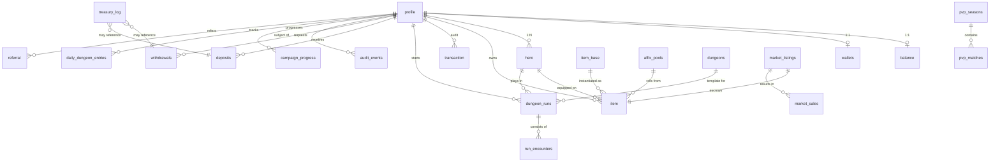

# Way Of The King — Схема базы данных

Версия: 0.1
Последнее обновление: 2026-04-27
СУБД: PostgreSQL 16

Документ описывает все таблицы, связи, индексы, триггеры и принципы проектирования. Финальный SQL живёт в Alembic-миграциях, этот документ — источник истины.

---

## 1. Конвенции

### 1.1 Именование

- **Таблицы** — `snake_case`, **единственное число** (`user`, `dungeon_run`, `transaction`). Один row = одна сущность.
- **Колонки** — `snake_case`, единственное число
- **Первичные ключи** — `id` (`bigserial` для основных, `uuid` для тех, что ссылаются клиентом)
- **Внешние ключи** — `<table>_id` (`profile_id`, `hero_id`)
- **Reserved/historical compound names**: `_user_*` суффиксы в FK-индексах/constraints приведены к `_profile_*` (тот же rename применён к `_character_*` → `_hero_*`)
- **Избегаем reserved words SQL.** `user` и `character` — зарезервированные слова, использование требовало бы постоянного квотирования (`"user"`). Поэтому исторически переименованы в `profile` и `hero`. При добавлении новых таблиц проверять на reserved-слова: [PostgreSQL keywords](https://www.postgresql.org/docs/current/sql-keywords-appendix.html).
- **Timestamp поля** — `*_at` (`created_at`, `updated_at`)
- **Boolean поля** — `is_*` или `has_*` (`is_blocked`, `has_kyc`)
- **Enum поля** — `SMALLINT` с маппингом в §1.5 (компактно + индексируется быстрее текста). Postgres native `enum` избегаем — больно мигрировать. Открытые таксономии (`item_base.kind`, `profile.locale` и т.п.) остаются `TEXT`.
- **Индексы** — `ix_<table>_<columns>` (`ix_profile_telegram_id`)
- **Constraints** — `ck_<table>_<rule>`, `uq_<table>_<columns>`
- **Foreign keys** — `fk_<table>_<column>`

### 1.2 Типы

- **Деньги/количества** — `BIGINT` (gold = "копейки", 1 UI gold = 1000 в БД)
- **Большие коллекции/JSON** — `JSONB` (с GIN индексом если нужен поиск)
- **Время** — `TIMESTAMPTZ` всегда (никогда `TIMESTAMP`)
- **Текст переменной длины** — `TEXT` (не `VARCHAR(N)`, длина проверяется на app-уровне)
- **Идентификаторы Telegram** — `BIGINT` (Telegram использует int64)
- **TON-адреса** — `TEXT` (длина переменная, для совместимости с raw / friendly форматами)
- **Хеши, mnemonic-derived ключи** — `BYTEA`

### 1.3 Принципы

- **Только-вперёд миграции** — никаких `DROP TABLE` для данных, только `ADD/RENAME`
- **Все балансовые операции — в DB транзакциях**
- **Soft delete для аудита** — блокировка вместо удаления для profile, item
- **`updated_at` через триггер** на всех таблицах с мутирующими данными
- **`idempotency_key`** на всех write-таблицах с внешним вызовом
- **Партиционирование** для high-volume (`transaction`, `audit_events`, `run_encounters`)
- **Enum-колонки с фиксированным набором — `SMALLINT` с маппингом** (см. §1.5). Только открытые таксономии (`item_base.kind`, `affix_definition.mod_type`, `profile.locale`) хранятся как `TEXT`.

### 1.5 Маппинг enum-значений (SMALLINT)

Все закрытые enum'ы — `SMALLINT` (2 байта) с фиксированным маппингом. **Это единственный источник истины** — константы в `backend/src/wotk/domain/enums.py` (Python `IntEnum`) и `realtime/src/schemas/enums.ts` (TS `enum`/`as const`) должны быть **сгенерированы** из этого документа или поддерживаться вручную с обязательным CI-чеком.

**Правила**:
- Никогда не переиспользовать значение — даже после удаления code устаревший value становится `_DEPRECATED_<old_name>`
- Новые значения добавляются в конец, никогда не вставляются в середину
- При выводе на UI / логи — конвертировать в строку через mapping, не показывать сырую цифру

#### `hero.class`
| Value | Code |
|---|---|
| 0 | KNIGHT |
| 1 | ARCHER |
| 2 | NECROMANCER |

#### `item.rarity`
| Value | Code |
|---|---|
| 0 | COMMON |
| 1 | MAGIC |
| 2 | RARE |
| 3 | EPIC |
| 4 | LEGENDARY |

#### `item.equipped_slot` и `item_base.slot`
| Value | Code |
|---|---|
| 0 | HELMET |
| 1 | CHEST |
| 2 | WEAPON |
| 3 | OFFHAND |
| 4 | BOOTS |
| 5 | RING |

#### `affix_definition.affix_type`
| Value | Code |
|---|---|
| 0 | PREFIX |
| 1 | SUFFIX |
| 2 | IMPLICIT |

#### `transaction.type`
| Value | Code | Note |
|---|---|---|
| 0 | DUNGEON_ENTRY | |
| 1 | DUNGEON_REWARD | |
| 2 | DUNGEON_REVIVE | |
| 3 | PVP_BET | v1.1 |
| 4 | PVP_REWARD | v1.1 |
| 5 | PVP_FEE | v1.1 |
| 6 | MARKET_LIST_FEE | v1 |
| 7 | MARKET_BUY | v1 |
| 8 | MARKET_SELL | v1 |
| 9 | MARKET_FEE | v1 |
| 10 | SHOP_BUY | |
| 11 | SHOP_SELL | |
| 12 | SHOP_REROLL | |
| 13 | SHOP_SALVAGE | |
| 14 | DEPOSIT | |
| 15 | WITHDRAW | |
| 16 | WITHDRAW_REFUND | |
| 17 | DAILY_REWARD | |
| 18 | REFERRAL_BONUS | |
| 19 | AIRDROP | |
| 20 | KORONA_PURCHASE | |
| 21 | ENERGY_PURCHASE | |
| 22 | ADMIN_ADJUST | |

#### `dungeons.theme`
| Value | Code |
|---|---|
| 0 | CRYPT |
| 1 | FOREST |
| 2 | CASTLE |
| 3 | TOWER |
| 4 | SWAMP |

#### `dungeons.difficulty`
| Value | Code |
|---|---|
| 0 | NORMAL |
| 1 | HARD |
| 2 | MYTHIC |

#### `dungeon_runs.status`
| Value | Code |
|---|---|
| 0 | IN_PROGRESS |
| 1 | COMPLETED |
| 2 | FAILED |
| 3 | FLED |
| 4 | ABANDONED |
| 5 | SETTLED |

#### `run_encounters.result`
| Value | Code |
|---|---|
| 0 | WIN |
| 1 | LOSS |
| 2 | FLED |

#### `deposits.status`
| Value | Code |
|---|---|
| 0 | DETECTED |
| 1 | CONFIRMED |
| 2 | CREDITED |
| 3 | FAILED |

#### `withdrawals.status`
| Value | Code |
|---|---|
| 0 | PENDING |
| 1 | AWAITING_2FA |
| 2 | PROCESSING |
| 3 | SENT |
| 4 | CONFIRMED |
| 5 | FAILED |
| 6 | REFUNDED |

#### `treasury_log.action`
| Value | Code |
|---|---|
| 0 | HOT_TO_COLD |
| 1 | COLD_TO_HOT |
| 2 | MANUAL_PAYOUT |
| 3 | RECONCILE_MISMATCH |
| 4 | REBALANCE |
| 5 | EMERGENCY_PAUSE |

#### `audit_events.event_type`
| Value | Code |
|---|---|
| 0 | LOGIN |
| 1 | LOGIN_FAILED |
| 2 | LOGIN_GEO_BLOCKED |
| 3 | WITHDRAW_REQUEST |
| 4 | WITHDRAW_2FA_FAILED |
| 5 | WITHDRAW_2FA_OK |
| 6 | DEPOSIT_DETECTED |
| 7 | USER_BLOCKED |
| 8 | USER_UNBLOCKED |
| 9 | ADMIN_ACTION |
| 10 | SUSPICIOUS_ACTIVITY |
| 11 | RECONCILE_MISMATCH |

#### `audit_events.severity`
| Value | Code |
|---|---|
| 0 | INFO |
| 1 | WARN |
| 2 | ALERT |
| 3 | CRITICAL |

#### `market_listings.status` (v1)
| Value | Code |
|---|---|
| 0 | ACTIVE |
| 1 | SOLD |
| 2 | EXPIRED |
| 3 | CANCELLED |

#### `pvp_seasons.status` (v1.1)
| Value | Code |
|---|---|
| 0 | UPCOMING |
| 1 | ACTIVE |
| 2 | ENDED |

#### `daily_quests.quest_type` (v1)
| Value | Code |
|---|---|
| 0 | KILL_X_MOBS |
| 1 | COMPLETE_DUNGEON |
| 2 | EQUIP_RARITY |
| 3 | LEVEL_UP |
| 4 | EARN_X_GOLD |

---

## 2. ER-диаграмма (Mermaid)



---

## 3. Таблицы — User & Auth

### 3.1 `profile`

Главная таблица аккаунтов. Один Telegram-юзер = одна запись.

| Колонка | Тип | NULL | Default | Описание |
|---|---|---|---|---|
| `id` | BIGSERIAL | — | — | PK |
| `telegram_id` | BIGINT | NOT NULL | — | Telegram user.id, уникален |
| `telegram_username` | TEXT | NULL | — | @username, denormalized для leaderboard. Обновляется на login |
| `telegram_first_name` | TEXT | NULL | — | для UI display |
| `locale` | TEXT | NOT NULL | `'ru'` | Текущий язык игры. Дефолт = `initData.user.language_code` при первом login. |
| `ip_country` | TEXT | NULL | — | ISO-код, обновляется при логине |
| `is_blocked` | BOOLEAN | NOT NULL | `false` | Бан (доступ закрыт) |
| `block_reason` | TEXT | NULL | — | Причина бана для аудита |
| `blocked_at` | TIMESTAMPTZ | NULL | — | Когда заблокирован |
| `is_admin` | BOOLEAN | NOT NULL | `false` | Доступ к админке |
| `withdrawal_2fa_enabled` | BOOLEAN | NOT NULL | `true` | 2FA через бота при выводе |
| `created_at` | TIMESTAMPTZ | NOT NULL | `now()` | |
| `updated_at` | TIMESTAMPTZ | NOT NULL | `now()` | Обновляется триггером |
| `last_seen_at` | TIMESTAMPTZ | NULL | — | Для DAU расчёта |

**Constraints:**
```sql
ALTER TABLE profile
  ADD CONSTRAINT uq_profile_telegram_id UNIQUE (telegram_id),
  ADD CONSTRAINT ck_profile_locale CHECK (locale IN ('ru','en','es','pt','zh','ar'));
```

**Индексы:**
```sql
CREATE INDEX ix_profile_telegram_id ON profile(telegram_id);
CREATE INDEX ix_profile_last_seen_at ON profile(last_seen_at) WHERE NOT is_blocked;
CREATE INDEX ix_profile_admin ON profile(id) WHERE is_admin;
```

**Триггеры:** `updated_at` (см. раздел 12).

**Заметки:**
- `telegram_language_code` намеренно не хранится — читается из `initData` при login и засетит `locale` на первый вход. Дальше `locale` независим.
- `device_fingerprint` отложен до v1 (когда появится anti-fraud скоринг). На MVP не используется.
- `referrer_profile_id` хранится только в `referral` (см. §3.2) — никакой денормализации в `profile`.
- 2FA-счётчики (`failed_2fa_count`, `last_2fa_attempt_at`) живут в Redis с естественным TTL — нет нужды в отдельной таблице.
- KYC поля **отсутствуют в MVP** — при подходе к регуляторному порогу выводов добавятся обратно.

### 3.2 `referral`

Реферальная программа. Учитывает только подтверждённых рефералов (прошли tutorial).

| Колонка | Тип | NULL | Default | Описание |
|---|---|---|---|---|
| `id` | BIGSERIAL | — | — | PK |
| `referrer_profile_id` | BIGINT | NOT NULL | — | Кто пригласил |
| `referred_profile_id` | BIGINT | NOT NULL | — | Кого пригласили |
| `confirmed_at` | TIMESTAMPTZ | NULL | — | Когда реферал прошёл tutorial |
| `bonus_paid_gold` | BIGINT | NOT NULL | `0` | Сколько уже выплачено за этого |
| `expires_at` | TIMESTAMPTZ | NOT NULL | — | Окно начислений (30 дней) |
| `created_at` | TIMESTAMPTZ | NOT NULL | `now()` | |

```sql
ALTER TABLE referral
  ADD CONSTRAINT uq_referral_referred UNIQUE (referred_profile_id),
  ADD CONSTRAINT fk_referral_referrer FOREIGN KEY (referrer_profile_id) REFERENCES profile(id),
  ADD CONSTRAINT fk_referral_referred FOREIGN KEY (referred_profile_id) REFERENCES profile(id);

CREATE INDEX ix_referral_referrer_active ON referral(referrer_profile_id, expires_at)
  WHERE confirmed_at IS NOT NULL;
```

---

## 4. Таблицы — Game character

### 4.1 `hero`

| Колонка | Тип | NULL | Default | Описание |
|---|---|---|---|---|
| `id` | BIGSERIAL | — | — | PK |
| `profile_id` | BIGINT | NOT NULL | — | Владелец |
| `class` | SMALLINT | NOT NULL | — | См. §1.5 (0=KNIGHT, 1=ARCHER, 2=NECROMANCER) |
| `name` | TEXT | NOT NULL | — | Игровое имя, 3–20 символов |
| `level` | INT | NOT NULL | `1` | Денормализация. Source of truth — `compute_level(xp)` в `wotk/game/leveling.py`. Обновляется в той же транзакции что и xp. |
| `xp` | BIGINT | NOT NULL | `0` | Накопленный опыт |
| `unspent_points` | JSONB | NOT NULL | `'{"stat":0,"skill":0}'` | Нераспределённые очки. Структура: `{"stat":int,"skill":int}` |
| `base_stats` | JSONB | NOT NULL | `'{"str":10,"dex":5,"int":3}'` | Распределённые очки |
| `passives` | JSONB | NOT NULL | `'[]'` | `["passive_id_1","passive_id_2"]` |
| `active_skills` | JSONB | NOT NULL | `'[]'` | 4 ID скиллов в hotbar |
| `created_at` | TIMESTAMPTZ | NOT NULL | `now()` | |
| `updated_at` | TIMESTAMPTZ | NOT NULL | `now()` | |
| `deleted_at` | TIMESTAMPTZ | NULL | — | Soft delete (опц., потом) |

**Constraints:**
```sql
-- ALTER TABLE hero
--   ADD CONSTRAINT fk_hero_profile FOREIGN KEY (profile_id) REFERENCES profile(id) ON DELETE CASCADE,
--   ADD CONSTRAINT ck_hero_class CHECK (class BETWEEN 0 AND 2),
--   ADD CONSTRAINT ck_hero_level CHECK (level BETWEEN 1 AND 100),
--   ADD CONSTRAINT ck_hero_xp CHECK (xp >= 0),
--   ADD CONSTRAINT ck_hero_name_len CHECK (char_length(name) BETWEEN 3 AND 20),
--   ADD CONSTRAINT ck_hero_unspent_points CHECK (
--     jsonb_typeof(unspent_points) = 'object'
--     AND jsonb_typeof(unspent_points->'stat') = 'number'
--     AND jsonb_typeof(unspent_points->'skill') = 'number'
--     AND (unspent_points->>'stat')::int >= 0
--     AND (unspent_points->>'skill')::int >= 0
--   );

-- В MVP: один персонаж определённого класса на юзера
CREATE UNIQUE INDEX uq_hero_profile_class ON hero(profile_id, class) WHERE deleted_at IS NULL;
```

**Индексы:**
```sql
CREATE INDEX ix_hero_profile ON hero(profile_id) WHERE deleted_at IS NULL;
CREATE INDEX ix_hero_level ON hero(level) WHERE deleted_at IS NULL;
```

**Заметки:**
- `is_blocked` отсутствует — бан на уровне аккаунта (`profile.is_blocked`), персонажи юзера автоматически недоступны.
- `total_playtime_seconds` не хранится — выводится через `audit_events` / session-логи при необходимости (для achievements в v1+).

**Заметка про JSONB-колонки** (`base_stats`, `unspent_points`, `passives`, `active_skills`):
- Чтение всегда вместе с character, изменения нечастые → JSONB оправдан
- `unspent_points` фиксированной структуры (2 числа), но в JSONB ради единообразия и простоты при добавлении новых типов очков (например, `mastery` в v1)
- Если в v2 потребуется аналитика по выбору пассивок — выделим в отдельную таблицу

---

## 5. Таблицы — Economy & Currency

### 5.1 `balance`

Состоит отдельно от `profile` потому что обновляется намного чаще и потенциально шардится по разным правилам.

| Колонка | Тип | NULL | Default | Описание |
|---|---|---|---|---|
| `profile_id` | BIGINT | NOT NULL | — | PK + FK |
| `gold` | BIGINT | NOT NULL | `0` | "Копейки" (1 UI gold = 1000) |
| `energy` | INT | NOT NULL | `100` | 0..energy_cap |
| `energy_cap` | INT | NOT NULL | `100` | Может расти от пассивок |
| `energy_updated_at` | TIMESTAMPTZ | NOT NULL | `now()` | Для lazy регенерации |
| `updated_at` | TIMESTAMPTZ | NOT NULL | `now()` | |

```sql
ALTER TABLE balance
  ADD CONSTRAINT pk_balance PRIMARY KEY (profile_id),
  ADD CONSTRAINT fk_balance_profile FOREIGN KEY (profile_id) REFERENCES profile(id) ON DELETE CASCADE,
  ADD CONSTRAINT ck_balance_gold_nonneg CHECK (gold >= 0),
  ADD CONSTRAINT ck_balance_energy CHECK (energy >= 0 AND energy <= energy_cap);
```

**Триггеры:** `updated_at` + проверка инвариантов через CHECK.

**Регенерация энергии** — не триггером, а функцией `regen_energy_for_profile(uid)`, вызываемой при чтении баланса в API (lazy regen). См. раздел 13.

**Принципы экономики:**
- **Только GOLD в `balance`** для MVP. WOTK не хранится здесь — учёт on-chain движений в `deposits` / `withdrawals`.
- **Нет `gold_locked`.** Подход «deduct immediately, refund on failure»: при request на withdrawal/listing — сразу списываем gold + INSERT транзакция, при cancel/failure — возвращаем + INSERT REFUND-транзакция. UI-показатель «pending» считается из `SUM(amount_wotk × rate) FROM withdrawals WHERE status IN (0,2)` (PENDING/PROCESSING) + аналогично для market.
- **Нет `shards` и `korona`** в MVP. Появятся когда:
  - SHARDS — Phase 5 (крафт + reroll affixes за осколки)
  - KORONA — когда заработает монетизация (purchase за Telegram Stars / TON)
- **Нет `wotk_pending`.** Тот же паттерн что с `gold_locked` — source of truth = `withdrawals` table.

### 5.2 `transaction`

Главная таблица аудита движений **gold**. Каждое изменение `balance.gold` = запись здесь.

| Колонка | Тип | NULL | Default | Описание |
|---|---|---|---|---|
| `id` | BIGSERIAL | — | — | PK |
| `profile_id` | BIGINT | NOT NULL | — | Кто |
| `type` | SMALLINT | NOT NULL | — | См. §1.5 transaction.type |
| `amount` | BIGINT | NOT NULL | — | Изменение gold. Может быть отрицательным. |
| `balance_after` | BIGINT | NOT NULL | — | `balance.gold` после операции (defensive accounting, для reconciliation) |
| `ref` | JSONB | NULL | — | `{run_id,item_id,tx_hash,withdrawal_id,...}` |
| `idempotency_key` | TEXT | NULL | — | UUID, может быть NULL для системных |
| `created_at` | TIMESTAMPTZ | NOT NULL | `now()` | |

```sql
ALTER TABLE transaction
  ADD CONSTRAINT fk_transaction_profile FOREIGN KEY (profile_id) REFERENCES profile(id),
  ADD CONSTRAINT ck_transaction_type CHECK (type BETWEEN 0 AND 22),
  ADD CONSTRAINT uq_transaction_idempotency UNIQUE (idempotency_key);
```

**Заметки:**
- Колонка `currency` отсутствует — `transaction` хранит только GOLD. WOTK accounting — в `deposits` / `withdrawals` через `tx_hash`. Если в v1 потребуется отдельный ledger для SHARDS/KORONA — добавим обратно или сделаем отдельные таблицы.
- `balance_after` = defensive copy: позволяет reconciliation cron'у быстро находить расхождения (`balance.gold` vs `last transaction.balance_after`).

**Индексы:**
```sql
CREATE INDEX ix_transaction_profile_created ON transaction(profile_id, created_at DESC);
CREATE INDEX ix_transaction_type_created ON transaction(type, created_at DESC);
CREATE INDEX ix_transaction_ref_run ON transaction((ref->>'run_id')) WHERE ref ? 'run_id';
```

**Партиционирование:** в MVP — обычная таблица, PRIMARY KEY (id). Партиционирование по `created_at` отложено до достижения ~10M+ строк или ~50k DAU (план в §14). Возврат потребует backfill-миграции с переносом существующих данных.

---

## 6. Таблицы — Items & Inventory

### 6.1 `item_base` (reference)

Статичный каталог базовых типов предметов. Заполняется через seeds, обновляется миграциями.

| Колонка | Тип | NULL | Default | Описание |
|---|---|---|---|---|
| `id` | TEXT | NOT NULL | — | PK, slug-стиль: `sword_2h_iron` |
| `slot` | SMALLINT | NOT NULL | — | См. §1.5 (0=HELMET, ..., 5=RING) |
| `kind` | TEXT | NOT NULL | — | sword_1h, axe_2h, bow, etc. (открытая таксономия → text) |
| `name_key` | TEXT | NOT NULL | — | i18n ключ |
| `min_ilvl` | INT | NOT NULL | `1` | С какого уровня может выпасть |
| `max_ilvl` | INT | NOT NULL | `60` | До какого |
| `base_stats` | JSONB | NOT NULL | — | `{"min_dmg":10,"max_dmg":15,"as":1.0}` |
| `allowed_classes` | JSONB | NOT NULL | `'[0,1,2]'` | Массив class.value (см. §1.5 hero.class) |
| `is_two_handed` | BOOLEAN | NOT NULL | `false` | Только для weapon |
| `created_at` | TIMESTAMPTZ | NOT NULL | `now()` | |

```sql
ALTER TABLE item_base
  ADD CONSTRAINT pk_item_base PRIMARY KEY (id),
  ADD CONSTRAINT ck_item_base_slot CHECK (slot BETWEEN 0 AND 5);

CREATE INDEX ix_item_base_slot_kind ON item_base(slot, kind);
```

### 6.2 `affix_definition` (reference)

Список всех возможных аффиксов для генерации предметов.

| Колонка | Тип | NULL | Default | Описание |
|---|---|---|---|---|
| `id` | TEXT | NOT NULL | — | PK, slug: `prefix_str_t1` |
| `affix_type` | SMALLINT | NOT NULL | — | См. §1.5 (0=PREFIX, 1=SUFFIX, 2=IMPLICIT) |
| `name_key` | TEXT | NOT NULL | — | i18n ключ |
| `min_ilvl` | INT | NOT NULL | `1` | На каком ilvl может появиться |
| `tier` | INT | NOT NULL | `1` | T1 (низкий) → T5 (высокий) |
| `weight` | INT | NOT NULL | `100` | Для weighted random |
| `applicable_slots` | JSONB | NOT NULL | — | Массив slot.value: `[2,0]` (weapon, helmet) |
| `mod_type` | TEXT | NOT NULL | — | `flat_str`, `pct_atk`, `flat_hp`, etc. (открытая таксономия → text) |
| `value_min` | INT | NOT NULL | — | Нижняя граница ролла |
| `value_max` | INT | NOT NULL | — | Верхняя граница ролла |
| `created_at` | TIMESTAMPTZ | NOT NULL | `now()` | |

```sql
ALTER TABLE affix_definition
  ADD CONSTRAINT pk_affix_definition PRIMARY KEY (id),
  ADD CONSTRAINT ck_affix_type CHECK (affix_type BETWEEN 0 AND 2),
  ADD CONSTRAINT ck_affix_value_range CHECK (value_min <= value_max),
  ADD CONSTRAINT ck_affix_tier CHECK (tier BETWEEN 1 AND 10);

CREATE INDEX ix_affix_def_type_ilvl ON affix_definition(affix_type, min_ilvl);
```

### 6.3 `item`

Все предметы юзеров. Каждая запись = уникальный предмет.

| Колонка | Тип | NULL | Default | Описание |
|---|---|---|---|---|
| `id` | BIGSERIAL | — | — | PK |
| `owner_profile_id` | BIGINT | NOT NULL | — | Текущий владелец |
| `base_id` | TEXT | NOT NULL | — | FK item_base.id |
| `rarity` | SMALLINT | NOT NULL | — | См. §1.5 (0=COMMON, ..., 4=LEGENDARY) |
| `ilvl` | INT | NOT NULL | — | Уровень при дропе |
| `affixes` | JSONB | NOT NULL | `'[]'` | `[{"id":"prefix_str_t2","value":15}]` |
| `equipped_on` | BIGINT | NULL | — | hero_id если надет |
| `equipped_slot` | SMALLINT | NULL | — | См. §1.5 (0=HELMET..5=RING). Только если equipped_on. |
| `inventory_position` | INT | NULL | — | 0..47 если в bag (NULL если equipped или в любом эскроу) |
| `is_in_market_escrow` | BOOLEAN | NOT NULL | `false` | Выставлен на маркете (v1) |
| `escrow_run_id` | UUID | NULL | — | Поднят в этом активном ране, ещё не claimed (см. RUN-LIFECYCLE.md) |
| `created_at` | TIMESTAMPTZ | NOT NULL | `now()` | |
| `updated_at` | TIMESTAMPTZ | NOT NULL | `now()` | |

**Constraints:**
```sql
ALTER TABLE item
  ADD CONSTRAINT fk_item_profile FOREIGN KEY (owner_profile_id) REFERENCES profile(id),
  ADD CONSTRAINT fk_item_base FOREIGN KEY (base_id) REFERENCES item_base(id),
  ADD CONSTRAINT fk_item_hero FOREIGN KEY (equipped_on) REFERENCES hero(id),
  ADD CONSTRAINT fk_item_escrow_run FOREIGN KEY (escrow_run_id) REFERENCES dungeon_runs(id),
  ADD CONSTRAINT ck_item_rarity CHECK (rarity BETWEEN 0 AND 4),
  ADD CONSTRAINT ck_item_position CHECK (inventory_position IS NULL OR inventory_position BETWEEN 0 AND 47),
  ADD CONSTRAINT ck_item_equipped_slot CHECK (equipped_slot IS NULL OR equipped_slot BETWEEN 0 AND 5),
  -- Предмет в одном из 4 состояний: на персонаже / в инвентаре / в маркет-эскроу / в run-эскроу
  ADD CONSTRAINT ck_item_state CHECK (
    (equipped_on IS NOT NULL AND equipped_slot IS NOT NULL AND inventory_position IS NULL AND NOT is_in_market_escrow AND escrow_run_id IS NULL) OR
    (equipped_on IS NULL AND equipped_slot IS NULL AND inventory_position IS NOT NULL AND NOT is_in_market_escrow AND escrow_run_id IS NULL) OR
    (equipped_on IS NULL AND equipped_slot IS NULL AND inventory_position IS NULL AND is_in_market_escrow AND escrow_run_id IS NULL) OR
    (equipped_on IS NULL AND equipped_slot IS NULL AND inventory_position IS NULL AND NOT is_in_market_escrow AND escrow_run_id IS NOT NULL)
  );

-- Один предмет на слот персонажа
CREATE UNIQUE INDEX uq_item_equipment_slot ON item(equipped_on, equipped_slot)
  WHERE equipped_on IS NOT NULL;

-- Один предмет на ячейку инвентаря
CREATE UNIQUE INDEX uq_item_inventory_position ON item(owner_profile_id, inventory_position)
  WHERE inventory_position IS NOT NULL;
```

**Семантика состояний:**
- **equipped** — надет на персонажа, занимает слот (`equipped_on`+`equipped_slot` set)
- **inventory** — в сумке, занимает ячейку 0..47 (`inventory_position` set)
- **market escrow** (v1) — выставлен на маркете, hold системы (`is_in_market_escrow=true`)
- **run escrow** — поднят игроком в активном ране (`escrow_run_id` set), материализован в БД, но ещё не в инвентаре до `claim`. Судьба определяется финальным статусом рана (см. §1.5 dungeon_runs.status):
  - `COMPLETED (=1)` → `SETTLED (=5)`: переходит в inventory или auto-sell если нет места
  - `FLED (=3)`: остаётся в run escrow до claim, потом → inventory
  - `FAILED (=2)`: 50% по броску RNG (по балансу) → inventory, остальное удаляется
  - `ABANDONED (=4)`: cron политика — 50% удаляется, 50% → inventory с уведомлением

**Индексы:**
```sql
CREATE INDEX ix_item_owner ON item(owner_profile_id)
  WHERE NOT is_in_market_escrow AND escrow_run_id IS NULL;
CREATE INDEX ix_item_owner_equipped ON item(owner_profile_id, equipped_on) WHERE equipped_on IS NOT NULL;
CREATE INDEX ix_item_rarity ON item(rarity);
-- Все предметы текущего рана (для claim/cleanup)
CREATE INDEX ix_item_escrow_run ON item(escrow_run_id) WHERE escrow_run_id IS NOT NULL;
-- GIN для поиска по аффиксам (для маркета)
CREATE INDEX ix_item_affixes_gin ON item USING gin(affixes jsonb_path_ops);
```

---

## 7. Таблицы — Wallet & TON

### 7.1 `wallets`

| Колонка | Тип | NULL | Default | Описание |
|---|---|---|---|---|
| `profile_id` | BIGINT | NOT NULL | — | PK + FK |
| `internal_ton_address` | TEXT | NOT NULL | — | Сгенерированный sub-address для депозитов |
| `internal_derivation_path` | TEXT | NOT NULL | — | BIP-44 path: `m/44'/607'/<profile_id>'` |
| `external_ton_address` | TEXT | NULL | — | Куда юзер выводит |
| `external_address_set_at` | TIMESTAMPTZ | NULL | — | Кулдаун на смену (24h) |
| `external_address_verified_at` | TIMESTAMPTZ | NULL | — | TonConnect proof received |
| `total_deposited_wotk` | BIGINT | NOT NULL | `0` | Кумулятивно |
| `total_withdrawn_wotk` | BIGINT | NOT NULL | `0` | Кумулятивно |
| `created_at` | TIMESTAMPTZ | NOT NULL | `now()` | |
| `updated_at` | TIMESTAMPTZ | NOT NULL | `now()` | |

```sql
ALTER TABLE wallets
  ADD CONSTRAINT pk_wallets PRIMARY KEY (profile_id),
  ADD CONSTRAINT fk_wallets_profile FOREIGN KEY (profile_id) REFERENCES profile(id) ON DELETE CASCADE,
  ADD CONSTRAINT uq_wallets_internal_address UNIQUE (internal_ton_address);

CREATE INDEX ix_wallets_internal_address ON wallets(internal_ton_address);
```

### 7.2 `deposits`

Входящие транзакции (TON → game gold).

| Колонка | Тип | NULL | Default | Описание |
|---|---|---|---|---|
| `id` | BIGSERIAL | — | — | PK |
| `profile_id` | BIGINT | NOT NULL | — | Кому зачисление |
| `tx_hash` | TEXT | NOT NULL | — | Уникальный onchain hash |
| `from_address` | TEXT | NOT NULL | — | Откуда пришли |
| `to_address` | TEXT | NOT NULL | — | Внутренний адрес юзера |
| `amount_wotk` | BIGINT | NOT NULL | — | Сумма jetton'ов |
| `block_seqno` | BIGINT | NOT NULL | — | TON block |
| `lt` | BIGINT | NOT NULL | — | Logical time (для ordering) |
| `credited_gold` | BIGINT | NULL | — | Сколько gold зачислено (по курсу на момент) |
| `exchange_rate` | NUMERIC(20, 8) | NULL | — | gold/WOTK на момент зачисления |
| `status` | SMALLINT | NOT NULL | `0` | См. §1.5 deposits.status (0=DETECTED..3=FAILED) |
| `failure_reason` | TEXT | NULL | — | Если FAILED |
| `detected_at` | TIMESTAMPTZ | NOT NULL | `now()` | |
| `confirmed_at` | TIMESTAMPTZ | NULL | — | После N подтверждений |
| `credited_at` | TIMESTAMPTZ | NULL | — | Когда зачислено в gold |

```sql
ALTER TABLE deposits
  ADD CONSTRAINT fk_deposits_profile FOREIGN KEY (profile_id) REFERENCES profile(id),
  ADD CONSTRAINT uq_deposits_tx_hash UNIQUE (tx_hash),
  ADD CONSTRAINT ck_deposits_status CHECK (status BETWEEN 0 AND 3),
  ADD CONSTRAINT ck_deposits_amount_pos CHECK (amount_wotk > 0);

CREATE INDEX ix_deposits_profile_created ON deposits(profile_id, detected_at DESC);
-- Все статусы кроме CREDITED (=2) для очереди обработки
CREATE INDEX ix_deposits_status ON deposits(status, detected_at) WHERE status != 2;
CREATE INDEX ix_deposits_to_address ON deposits(to_address);
```

### 7.3 `withdrawals`

Исходящие транзакции (game gold → TON).

| Колонка | Тип | NULL | Default | Описание |
|---|---|---|---|---|
| `id` | BIGSERIAL | — | — | PK |
| `profile_id` | BIGINT | NOT NULL | — | Инициатор |
| `to_address` | TEXT | NOT NULL | — | Куда выводить |
| `gold_debited` | BIGINT | NOT NULL | — | Сколько gold списано |
| `amount_wotk` | BIGINT | NOT NULL | — | Сколько WOTK к отправке |
| `exchange_rate` | NUMERIC(20, 8) | NOT NULL | — | На момент создания |
| `status` | SMALLINT | NOT NULL | `0` | См. §1.5 withdrawals.status (0=PENDING..6=REFUNDED) |
| `tfa_code_hash` | TEXT | NULL | — | bcrypt от 6-значного кода |
| `tfa_attempts` | INT | NOT NULL | `0` | |
| `tfa_expires_at` | TIMESTAMPTZ | NULL | — | TTL ~10 мин |
| `tx_hash` | TEXT | NULL | — | Onchain после SENT |
| `failure_reason` | TEXT | NULL | — | |
| `retry_count` | INT | NOT NULL | `0` | Для idempotent ретраев |
| `idempotency_key` | TEXT | NULL | — | UUID от клиента |
| `created_at` | TIMESTAMPTZ | NOT NULL | `now()` | |
| `updated_at` | TIMESTAMPTZ | NOT NULL | `now()` | |
| `confirmed_at` | TIMESTAMPTZ | NULL | — | |

```sql
ALTER TABLE withdrawals
  ADD CONSTRAINT fk_withdrawals_profile FOREIGN KEY (profile_id) REFERENCES profile(id),
  ADD CONSTRAINT uq_withdrawals_idempotency UNIQUE (idempotency_key),
  ADD CONSTRAINT uq_withdrawals_tx_hash UNIQUE (tx_hash),
  ADD CONSTRAINT ck_withdrawals_status CHECK (status BETWEEN 0 AND 6),
  ADD CONSTRAINT ck_withdrawals_amount_pos CHECK (amount_wotk > 0);

CREATE INDEX ix_withdrawals_profile_created ON withdrawals(profile_id, created_at DESC);
-- Очередь обработки: PENDING (0) или PROCESSING (2)
CREATE INDEX ix_withdrawals_pending ON withdrawals(created_at) WHERE status IN (0, 2);
CREATE INDEX ix_withdrawals_status ON withdrawals(status, updated_at);
```

### 7.4 `treasury_log`

Аудит операций с горячим/холодным кошельком (rebalance, manual).

| Колонка | Тип | NULL | Default | Описание |
|---|---|---|---|---|
| `id` | BIGSERIAL | — | — | PK |
| `action` | SMALLINT | NOT NULL | — | См. §1.5 treasury_log.action (0=HOT_TO_COLD..5=EMERGENCY_PAUSE) |
| `amount_wotk` | BIGINT | NOT NULL | — | Может быть отрицательным |
| `hot_balance_after` | BIGINT | NOT NULL | — | Снепшот для аудита |
| `cold_balance_after` | BIGINT | NOT NULL | — | Снепшот для аудита |
| `db_total_gold_value` | BIGINT | NOT NULL | — | Сумма всех balance.gold |
| `tx_hash` | TEXT | NULL | — | Onchain если применимо |
| `withdrawal_id` | BIGINT | NULL | — | FK если связан с выводом |
| `deposit_id` | BIGINT | NULL | — | FK если связан с депозитом |
| `initiated_by` | TEXT | NOT NULL | — | system_cron / admin:<profile_id> (свободный текст для аудита) |
| `note` | TEXT | NULL | — | |
| `created_at` | TIMESTAMPTZ | NOT NULL | `now()` | |

```sql
ALTER TABLE treasury_log
  ADD CONSTRAINT fk_treasury_withdrawal FOREIGN KEY (withdrawal_id) REFERENCES withdrawals(id),
  ADD CONSTRAINT fk_treasury_deposit FOREIGN KEY (deposit_id) REFERENCES deposits(id),
  ADD CONSTRAINT ck_treasury_action CHECK (action BETWEEN 0 AND 5);

CREATE INDEX ix_treasury_log_created ON treasury_log(created_at DESC);
CREATE INDEX ix_treasury_log_action ON treasury_log(action, created_at DESC);
```

---

## 8. Таблицы — Dungeons & Combat

### 8.1 `dungeons` (reference)

| Колонка | Тип | NULL | Default | Описание |
|---|---|---|---|---|
| `id` | TEXT | NOT NULL | — | PK: `crypt_normal`, `crypt_hard`, ... |
| `name_key` | TEXT | NOT NULL | — | i18n ключ |
| `theme` | SMALLINT | NOT NULL | — | См. §1.5 (0=CRYPT..4=SWAMP) |
| `difficulty` | SMALLINT | NOT NULL | — | См. §1.5 (0=NORMAL, 1=HARD, 2=MYTHIC) |
| `min_level` | INT | NOT NULL | `1` | |
| `entry_cost_gold` | BIGINT | NOT NULL | — | В "копейках" |
| `entry_cost_energy` | INT | NOT NULL | `10` | |
| `daily_limit` | INT | NOT NULL | `5` | Входов в сутки |
| `floors_count` | INT | NOT NULL | `5` | Включая босса |
| `config` | JSONB | NOT NULL | — | Полная конфигурация: floors, encounters, loot tables, boss |
| `xp_base` | INT | NOT NULL | — | Базовый XP за прохождение |
| `gold_base` | BIGINT | NOT NULL | — | Базовая награда |
| `is_enabled` | BOOLEAN | NOT NULL | `true` | Чтобы выключать без миграций |
| `created_at` | TIMESTAMPTZ | NOT NULL | `now()` | |
| `updated_at` | TIMESTAMPTZ | NOT NULL | `now()` | |

```sql
ALTER TABLE dungeons
  ADD CONSTRAINT pk_dungeons PRIMARY KEY (id),
  ADD CONSTRAINT ck_dungeons_theme CHECK (theme BETWEEN 0 AND 4),
  ADD CONSTRAINT ck_dungeons_difficulty CHECK (difficulty BETWEEN 0 AND 2);

CREATE INDEX ix_dungeons_enabled ON dungeons(is_enabled, min_level);
```

### 8.2 `dungeon_runs`

Главная таблица активных и завершённых ранов. Подробный жизненный цикл и failure-сценарии описаны в [RUN-LIFECYCLE.md](RUN-LIFECYCLE.md).

| Колонка | Тип | NULL | Default | Описание |
|---|---|---|---|---|
| `id` | UUID | NOT NULL | `gen_random_uuid()` | PK |
| `profile_id` | BIGINT | NOT NULL | — | |
| `hero_id` | BIGINT | NOT NULL | — | |
| `dungeon_id` | TEXT | NOT NULL | — | FK |
| `seed` | BYTEA | NOT NULL | — | 32 байта, фиксирует RNG (для replay при reconnect) |
| `status` | SMALLINT | NOT NULL | `0` | См. §1.5 dungeon_runs.status (0=IN_PROGRESS..5=SETTLED) |
| `current_floor` | INT | NOT NULL | `0` | Последний завершённый этаж (0 = ещё на 1-м) |
| `hero_state` | JSONB | NOT NULL | — | Снимок персонажа на момент **входа в текущий этаж** (HP, mana, бафы). Обновляется при floor transition checkpoint. Используется для recovery после disconnect > grace. |
| `pending_gold` | BIGINT | NOT NULL | `0` | Накопленное золото с пройденных этажей. Лут материализуется в `item` сразу при pickup (не здесь). |
| `entry_paid_gold` | BIGINT | NOT NULL | — | Сколько списали при входе |
| `entry_paid_energy` | INT | NOT NULL | — | |
| `revives_used` | INT | NOT NULL | `0` | Сколько раз воскресал (стоимость в gold увеличивается с каждым revive) |
| `realtime_node_id` | TEXT | NULL | — | На каком Colyseus-инстансе ран сейчас живёт (sticky routing при scale-out) |
| `started_at` | TIMESTAMPTZ | NOT NULL | `now()` | |
| `last_activity_at` | TIMESTAMPTZ | NOT NULL | `now()` | Обновляется на каждый floor transition |
| `last_checkpoint_at` | TIMESTAMPTZ | NOT NULL | `now()` | Когда был последний successful checkpoint |
| `finished_at` | TIMESTAMPTZ | NULL | — | |
| `expires_at` | TIMESTAMPTZ | NOT NULL | — | now() + 24h, для cleanup_expired_runs cron |

```sql
ALTER TABLE dungeon_runs
  ADD CONSTRAINT fk_runs_profile FOREIGN KEY (profile_id) REFERENCES profile(id),
  ADD CONSTRAINT fk_runs_hero FOREIGN KEY (hero_id) REFERENCES hero(id),
  ADD CONSTRAINT fk_runs_dungeon FOREIGN KEY (dungeon_id) REFERENCES dungeons(id),
  ADD CONSTRAINT ck_runs_status CHECK (status BETWEEN 0 AND 5),
  ADD CONSTRAINT ck_runs_floor_nonneg CHECK (current_floor >= 0);

-- Только один активный run на персонаже (status = IN_PROGRESS = 0)
CREATE UNIQUE INDEX uq_runs_one_active_per_hero ON dungeon_runs(hero_id)
  WHERE status = 0;

CREATE INDEX ix_runs_profile_started ON dungeon_runs(profile_id, started_at DESC);
CREATE INDEX ix_runs_status_expires ON dungeon_runs(status, expires_at)
  WHERE status = 0;
CREATE INDEX ix_runs_dungeon_status ON dungeon_runs(dungeon_id, status);
```

**Партиционирование:** по месяцу `started_at` после MVP (когда таблица перевалит 10M+ строк).

### 8.3 `run_encounters`

Лог боёв в ране для replay-аудита.

| Колонка | Тип | NULL | Default | Описание |
|---|---|---|---|---|
| `id` | BIGSERIAL | — | — | PK |
| `run_id` | UUID | NOT NULL | — | FK |
| `floor` | INT | NOT NULL | — | |
| `encounter_idx` | INT | NOT NULL | — | Внутри этажа |
| `enemies_spawned` | JSONB | NOT NULL | — | Snapshot мобов |
| `combat_summary` | JSONB | NOT NULL | — | `{damage_dealt,damage_taken,duration_s,deaths}` |
| `loot_rolled` | JSONB | NOT NULL | `'[]'` | Что упало |
| `gold_rolled` | BIGINT | NOT NULL | `0` | |
| `result` | SMALLINT | NOT NULL | — | См. §1.5 (0=WIN, 1=LOSS, 2=FLED) |
| `created_at` | TIMESTAMPTZ | NOT NULL | `now()` | |

```sql
ALTER TABLE run_encounters
  ADD CONSTRAINT fk_encounters_run FOREIGN KEY (run_id) REFERENCES dungeon_runs(id) ON DELETE CASCADE,
  ADD CONSTRAINT uq_encounters_run_floor_idx UNIQUE (run_id, floor, encounter_idx),
  ADD CONSTRAINT ck_encounters_result CHECK (result BETWEEN 0 AND 2);

CREATE INDEX ix_encounters_run ON run_encounters(run_id);
```

**Партиционирование:** по месяцу `created_at`. Это самая большая таблица в long-term.

### 8.4 `daily_dungeon_entries`

Учёт лимитов входов в сутки.

| Колонка | Тип | NULL | Default | Описание |
|---|---|---|---|---|
| `profile_id` | BIGINT | NOT NULL | — | |
| `dungeon_id` | TEXT | NOT NULL | — | |
| `date_utc` | DATE | NOT NULL | — | UTC-день |
| `count` | INT | NOT NULL | `0` | Сколько входов сегодня |
| `updated_at` | TIMESTAMPTZ | NOT NULL | `now()` | |

```sql
ALTER TABLE daily_dungeon_entries
  ADD CONSTRAINT pk_daily_entries PRIMARY KEY (profile_id, dungeon_id, date_utc),
  ADD CONSTRAINT fk_daily_entries_profile FOREIGN KEY (profile_id) REFERENCES profile(id) ON DELETE CASCADE,
  ADD CONSTRAINT fk_daily_entries_dungeon FOREIGN KEY (dungeon_id) REFERENCES dungeons(id);

CREATE INDEX ix_daily_entries_date ON daily_dungeon_entries(date_utc);
-- Cleanup старше 30 дней (cron)
```

### 8.5 `campaign_progress`

Прогрессия кампании на персонажа.

| Колонка | Тип | NULL | Default | Описание |
|---|---|---|---|---|
| `hero_id` | BIGINT | NOT NULL | — | |
| `act` | INT | NOT NULL | — | 1, 2, 3 |
| `location` | INT | NOT NULL | — | 1..5 в акте |
| `first_completed_at` | TIMESTAMPTZ | NOT NULL | `now()` | |
| `best_clear_time_s` | INT | NULL | — | Для персональных рекордов |
| `completion_count` | INT | NOT NULL | `1` | Сколько раз прошёл |

```sql
ALTER TABLE campaign_progress
  ADD CONSTRAINT pk_campaign_progress PRIMARY KEY (hero_id, act, location),
  ADD CONSTRAINT fk_campaign_hero FOREIGN KEY (hero_id) REFERENCES hero(id) ON DELETE CASCADE,
  ADD CONSTRAINT ck_campaign_act CHECK (act BETWEEN 1 AND 5),
  ADD CONSTRAINT ck_campaign_loc CHECK (location BETWEEN 1 AND 10);
```

---

## 9. Таблицы — Marketplace (v1.0)

### 9.1 `market_listings`

| Колонка | Тип | NULL | Default | Описание |
|---|---|---|---|---|
| `id` | BIGSERIAL | — | — | PK |
| `seller_profile_id` | BIGINT | NOT NULL | — | |
| `item_id` | BIGINT | NOT NULL | — | FK; на момент листинга `is_in_market_escrow=true` |
| `price_gold` | BIGINT | NOT NULL | — | "Копейки" |
| `expires_at` | TIMESTAMPTZ | NOT NULL | — | now() + duration |
| `status` | SMALLINT | NOT NULL | `0` | См. §1.5 (0=ACTIVE..3=CANCELLED) |
| `listed_at` | TIMESTAMPTZ | NOT NULL | `now()` | |
| `closed_at` | TIMESTAMPTZ | NULL | — | |

```sql
ALTER TABLE market_listings
  ADD CONSTRAINT fk_listings_seller FOREIGN KEY (seller_profile_id) REFERENCES profile(id),
  ADD CONSTRAINT fk_listings_item FOREIGN KEY (item_id) REFERENCES item(id),
  ADD CONSTRAINT ck_listings_status CHECK (status BETWEEN 0 AND 3),
  ADD CONSTRAINT ck_listings_price_pos CHECK (price_gold > 0);

-- Один активный листинг на предмет (status = ACTIVE = 0)
CREATE UNIQUE INDEX uq_listings_one_active_per_item ON market_listings(item_id)
  WHERE status = 0;

-- Hot path: поиск активных листингов
CREATE INDEX ix_listings_active_price ON market_listings(price_gold)
  WHERE status = 0;
CREATE INDEX ix_listings_seller ON market_listings(seller_profile_id, listed_at DESC);
CREATE INDEX ix_listings_expiry ON market_listings(expires_at)
  WHERE status = 0;
```

### 9.2 `market_sales`

| Колонка | Тип | NULL | Default | Описание |
|---|---|---|---|---|
| `id` | BIGSERIAL | — | — | PK |
| `listing_id` | BIGINT | NOT NULL | — | FK |
| `seller_profile_id` | BIGINT | NOT NULL | — | Денормализация для скорости |
| `buyer_profile_id` | BIGINT | NOT NULL | — | |
| `item_id` | BIGINT | NOT NULL | — | |
| `item_snapshot` | JSONB | NOT NULL | — | Полный snapshot предмета на момент продажи (для аналитики) |
| `price_gold` | BIGINT | NOT NULL | — | |
| `fee_gold` | BIGINT | NOT NULL | — | Комиссия маркета |
| `seller_received_gold` | BIGINT | NOT NULL | — | price - fee |
| `sold_at` | TIMESTAMPTZ | NOT NULL | `now()` | |

```sql
ALTER TABLE market_sales
  ADD CONSTRAINT fk_sales_listing FOREIGN KEY (listing_id) REFERENCES market_listings(id),
  ADD CONSTRAINT fk_sales_seller FOREIGN KEY (seller_profile_id) REFERENCES profile(id),
  ADD CONSTRAINT fk_sales_buyer FOREIGN KEY (buyer_profile_id) REFERENCES profile(id),
  ADD CONSTRAINT fk_sales_item FOREIGN KEY (item_id) REFERENCES item(id);

CREATE INDEX ix_sales_seller_sold ON market_sales(seller_profile_id, sold_at DESC);
CREATE INDEX ix_sales_buyer_sold ON market_sales(buyer_profile_id, sold_at DESC);
CREATE INDEX ix_sales_sold_at ON market_sales(sold_at DESC);
-- Для аналитики цен по типу
CREATE INDEX ix_sales_item_snapshot_base ON market_sales((item_snapshot->>'base_id'));
```

---

## 10. Таблицы — PvP (v1.1)

### 10.1 `pvp_seasons`

| Колонка | Тип | NULL | Default | Описание |
|---|---|---|---|---|
| `id` | INT | NOT NULL | — | PK: 1, 2, 3, ... |
| `name_key` | TEXT | NOT NULL | — | i18n |
| `starts_at` | TIMESTAMPTZ | NOT NULL | — | |
| `ends_at` | TIMESTAMPTZ | NOT NULL | — | |
| `status` | SMALLINT | NOT NULL | `0` | См. §1.5 (0=UPCOMING, 1=ACTIVE, 2=ENDED) |
| `rewards_config` | JSONB | NOT NULL | — | Награды по тиерам |
| `created_at` | TIMESTAMPTZ | NOT NULL | `now()` | |

```sql
ALTER TABLE pvp_seasons
  ADD CONSTRAINT pk_pvp_seasons PRIMARY KEY (id),
  ADD CONSTRAINT ck_pvp_season_status CHECK (status BETWEEN 0 AND 2);

CREATE INDEX ix_pvp_seasons_status ON pvp_seasons(status);
```

### 10.2 `pvp_matches`

| Колонка | Тип | NULL | Default | Описание |
|---|---|---|---|---|
| `id` | UUID | NOT NULL | `gen_random_uuid()` | PK |
| `season_id` | INT | NOT NULL | — | FK |
| `player1_profile_id` | BIGINT | NOT NULL | — | |
| `player1_hero_id` | BIGINT | NOT NULL | — | |
| `player1_elo_before` | INT | NOT NULL | — | |
| `player1_elo_after` | INT | NOT NULL | — | |
| `player2_profile_id` | BIGINT | NOT NULL | — | |
| `player2_hero_id` | BIGINT | NOT NULL | — | |
| `player2_elo_before` | INT | NOT NULL | — | |
| `player2_elo_after` | INT | NOT NULL | — | |
| `bet_gold` | BIGINT | NOT NULL | — | На каждого |
| `pot_gold` | BIGINT | NOT NULL | — | bet × 2 - fee |
| `fee_gold` | BIGINT | NOT NULL | — | |
| `winner_profile_id` | BIGINT | NULL | — | NULL если ничья (timeout) |
| `duration_s` | INT | NOT NULL | — | |
| `combat_summary` | JSONB | NOT NULL | — | Replay-friendly |
| `played_at` | TIMESTAMPTZ | NOT NULL | `now()` | |

```sql
ALTER TABLE pvp_matches
  ADD CONSTRAINT fk_pvp_season FOREIGN KEY (season_id) REFERENCES pvp_seasons(id),
  ADD CONSTRAINT fk_pvp_p1 FOREIGN KEY (player1_profile_id) REFERENCES profile(id),
  ADD CONSTRAINT fk_pvp_p2 FOREIGN KEY (player2_profile_id) REFERENCES profile(id),
  ADD CONSTRAINT fk_pvp_winner FOREIGN KEY (winner_profile_id) REFERENCES profile(id),
  ADD CONSTRAINT ck_pvp_distinct_players CHECK (player1_profile_id != player2_profile_id);

CREATE INDEX ix_pvp_p1_played ON pvp_matches(player1_profile_id, played_at DESC);
CREATE INDEX ix_pvp_p2_played ON pvp_matches(player2_profile_id, played_at DESC);
CREATE INDEX ix_pvp_season_played ON pvp_matches(season_id, played_at DESC);
```

### 10.3 `pvp_player_stats`

Денормализованный счётчик для leaderboard (быстрее, чем агрегировать по `pvp_matches`).

| Колонка | Тип | NULL | Default | Описание |
|---|---|---|---|---|
| `season_id` | INT | NOT NULL | — | |
| `profile_id` | BIGINT | NOT NULL | — | |
| `hero_id` | BIGINT | NOT NULL | — | |
| `elo` | INT | NOT NULL | `1000` | Текущий рейтинг |
| `wins` | INT | NOT NULL | `0` | |
| `losses` | INT | NOT NULL | `0` | |
| `draws` | INT | NOT NULL | `0` | |
| `total_gold_won` | BIGINT | NOT NULL | `0` | |
| `total_gold_lost` | BIGINT | NOT NULL | `0` | |
| `last_match_at` | TIMESTAMPTZ | NULL | — | |
| `updated_at` | TIMESTAMPTZ | NOT NULL | `now()` | |

```sql
ALTER TABLE pvp_player_stats
  ADD CONSTRAINT pk_pvp_stats PRIMARY KEY (season_id, profile_id),
  ADD CONSTRAINT fk_pvp_stats_season FOREIGN KEY (season_id) REFERENCES pvp_seasons(id),
  ADD CONSTRAINT fk_pvp_stats_profile FOREIGN KEY (profile_id) REFERENCES profile(id),
  ADD CONSTRAINT fk_pvp_stats_hero FOREIGN KEY (hero_id) REFERENCES hero(id);

-- Leaderboard query
CREATE INDEX ix_pvp_stats_leaderboard ON pvp_player_stats(season_id, elo DESC);
```

---

## 11. Таблицы — Audit & Operations

### 11.1 `audit_events`

Security-чувствительные события. Долгоживущие (≥ 1 год).

| Колонка | Тип | NULL | Default | Описание |
|---|---|---|---|---|
| `id` | BIGSERIAL | — | — | PK |
| `profile_id` | BIGINT | NULL | — | NULL для системных |
| `event_type` | SMALLINT | NOT NULL | — | См. §1.5 audit_events.event_type |
| `severity` | SMALLINT | NOT NULL | `0` | См. §1.5 (0=INFO..3=CRITICAL) |
| `payload` | JSONB | NOT NULL | `'{}'` | Контекстные данные |
| `ip` | INET | NULL | — | |
| `user_agent` | TEXT | NULL | — | |
| `country` | TEXT | NULL | — | |
| `created_at` | TIMESTAMPTZ | NOT NULL | `now()` | |

```sql
ALTER TABLE audit_events
  ADD CONSTRAINT fk_audit_profile FOREIGN KEY (profile_id) REFERENCES profile(id),
  ADD CONSTRAINT ck_audit_event_type CHECK (event_type BETWEEN 0 AND 11),
  ADD CONSTRAINT ck_audit_severity CHECK (severity BETWEEN 0 AND 3);

CREATE INDEX ix_audit_profile_created ON audit_events(profile_id, created_at DESC);
CREATE INDEX ix_audit_type_created ON audit_events(event_type, created_at DESC);
-- Высокий severity: ALERT (=2) или CRITICAL (=3)
CREATE INDEX ix_audit_severity ON audit_events(severity, created_at DESC) WHERE severity >= 2;
```

**Партиционирование:** по месяцу.

### 11.2 `idempotency_keys`

Кэш ответов для idempotent POST-операций.

| Колонка | Тип | NULL | Default | Описание |
|---|---|---|---|---|
| `key` | TEXT | NOT NULL | — | PK, обычно UUID от клиента |
| `profile_id` | BIGINT | NOT NULL | — | Чтобы не было коллизий между юзерами |
| `endpoint` | TEXT | NOT NULL | — | `/api/v1/inventory/equip` |
| `request_hash` | TEXT | NOT NULL | — | SHA-256 от тела запроса (защита от reuse с другим payload) |
| `response_status` | INT | NOT NULL | — | HTTP status |
| `response_body` | JSONB | NULL | — | Закэшированный ответ |
| `created_at` | TIMESTAMPTZ | NOT NULL | `now()` | |
| `expires_at` | TIMESTAMPTZ | NOT NULL | — | now() + 24h |

```sql
ALTER TABLE idempotency_keys
  ADD CONSTRAINT pk_idem PRIMARY KEY (key, profile_id),
  ADD CONSTRAINT fk_idem_profile FOREIGN KEY (profile_id) REFERENCES profile(id) ON DELETE CASCADE;

CREATE INDEX ix_idem_expires ON idempotency_keys(expires_at);
-- Cleanup-cron убирает expired
```

### 11.3 `daily_quests` (v1)

Динамически генерируемые квесты.

| Колонка | Тип | NULL | Default | Описание |
|---|---|---|---|---|
| `id` | BIGSERIAL | — | — | PK |
| `profile_id` | BIGINT | NOT NULL | — | |
| `date_utc` | DATE | NOT NULL | — | На какой день |
| `quest_type` | SMALLINT | NOT NULL | — | См. §1.5 daily_quests.quest_type |
| `params` | JSONB | NOT NULL | — | `{target: 50, mob_type: "skeleton"}` |
| `progress` | JSONB | NOT NULL | `'{}'` | `{killed: 12}` |
| `is_completed` | BOOLEAN | NOT NULL | `false` | |
| `is_claimed` | BOOLEAN | NOT NULL | `false` | |
| `reward_gold` | BIGINT | NOT NULL | — | |
| `reward_xp` | INT | NOT NULL | — | |
| `created_at` | TIMESTAMPTZ | NOT NULL | `now()` | |
| `completed_at` | TIMESTAMPTZ | NULL | — | |

```sql
ALTER TABLE daily_quests
  ADD CONSTRAINT fk_dq_profile FOREIGN KEY (profile_id) REFERENCES profile(id) ON DELETE CASCADE,
  ADD CONSTRAINT uq_dq_profile_date_type UNIQUE (profile_id, date_utc, quest_type),
  ADD CONSTRAINT ck_dq_quest_type CHECK (quest_type BETWEEN 0 AND 4);

CREATE INDEX ix_dq_profile_date ON daily_quests(profile_id, date_utc);
CREATE INDEX ix_dq_active ON daily_quests(profile_id) WHERE NOT is_claimed;
```

---

## 12. Триггеры

### 12.1 Автоматическое `updated_at`

Универсальный триггер для всех таблиц с этой колонкой.

```sql
CREATE OR REPLACE FUNCTION trg_set_updated_at()
RETURNS TRIGGER AS $$
BEGIN
  NEW.updated_at = now();
  RETURN NEW;
END;
$$ LANGUAGE plpgsql;

-- Применяется к каждой таблице с updated_at
CREATE TRIGGER trg_profile_updated_at
  BEFORE UPDATE ON profile
  FOR EACH ROW EXECUTE FUNCTION trg_set_updated_at();

-- Аналогично для hero, balance, item, wallets, deposits, withdrawals,
-- market_listings, pvp_player_stats, daily_dungeon_entries, dungeons, ...
```

### 12.2 Audit on profile block

```sql
CREATE OR REPLACE FUNCTION trg_profile_block_audit()
RETURNS TRIGGER AS $$
BEGIN
  IF NEW.is_blocked = true AND OLD.is_blocked = false THEN
    -- event_type=7 (USER_BLOCKED), severity=2 (ALERT) — см. §1.5
    INSERT INTO audit_events(profile_id, event_type, severity, payload, created_at)
    VALUES (NEW.id, 7, 2,
            jsonb_build_object('reason', NEW.block_reason), now());
  END IF;
  RETURN NEW;
END;
$$ LANGUAGE plpgsql;

CREATE TRIGGER trg_profile_block_audit
  AFTER UPDATE ON profile
  FOR EACH ROW
  WHEN (NEW.is_blocked IS DISTINCT FROM OLD.is_blocked)
  EXECUTE FUNCTION trg_profile_block_audit();
```

### 12.3 Auto-update `last_activity_at` для `dungeon_runs`

```sql
CREATE OR REPLACE FUNCTION trg_run_activity()
RETURNS TRIGGER AS $$
BEGIN
  IF NEW.current_floor != OLD.current_floor OR
     NEW.pending_gold != OLD.pending_gold THEN
    NEW.last_activity_at = now();
    NEW.last_checkpoint_at = now();
  END IF;
  RETURN NEW;
END;
$$ LANGUAGE plpgsql;

CREATE TRIGGER trg_runs_activity
  BEFORE UPDATE ON dungeon_runs
  FOR EACH ROW
  WHEN (OLD.status = 0)  -- IN_PROGRESS, см. §1.5
  EXECUTE FUNCTION trg_run_activity();
```

### 12.4 Запрет понижения totals в wallets

```sql
CREATE OR REPLACE FUNCTION trg_wallet_totals_only_grow()
RETURNS TRIGGER AS $$
BEGIN
  IF NEW.total_deposited_wotk < OLD.total_deposited_wotk THEN
    RAISE EXCEPTION 'total_deposited_wotk can only grow';
  END IF;
  IF NEW.total_withdrawn_wotk < OLD.total_withdrawn_wotk THEN
    RAISE EXCEPTION 'total_withdrawn_wotk can only grow';
  END IF;
  RETURN NEW;
END;
$$ LANGUAGE plpgsql;

CREATE TRIGGER trg_wallets_totals_grow
  BEFORE UPDATE ON wallets
  FOR EACH ROW EXECUTE FUNCTION trg_wallet_totals_only_grow();
```

### 12.5 Решение «не использовать»

Намеренно НЕ ставим триггер на `INSERT INTO transaction` для автоматического обновления `balance`. Причина: эту логику делает приложение в одной DB-транзакции с явными контролями (CHECK CONSTRAINT уже не пропустит negative balance). Триггер тут добавит магию и затруднит дебаг.

---

## 13. Функции (хранимые процедуры)

### 13.1 `regen_energy_for_profile(uid BIGINT) RETURNS INT`

Lazy-регенерация энергии при чтении баланса.

```sql
CREATE OR REPLACE FUNCTION regen_energy_for_profile(uid BIGINT)
RETURNS INT AS $$
DECLARE
  current_energy INT;
  current_cap INT;
  last_update TIMESTAMPTZ;
  elapsed_minutes INT;
  regen_amount INT;
  new_energy INT;
BEGIN
  SELECT energy, energy_cap, energy_updated_at
    INTO current_energy, current_cap, last_update
  FROM balance WHERE profile_id = uid FOR UPDATE;

  IF current_energy >= current_cap THEN
    RETURN current_energy;
  END IF;

  elapsed_minutes := EXTRACT(EPOCH FROM (now() - last_update)) / 60;
  regen_amount := elapsed_minutes / 6;  -- 1 ед / 6 мин

  IF regen_amount = 0 THEN
    RETURN current_energy;
  END IF;

  new_energy := LEAST(current_energy + regen_amount, current_cap);

  UPDATE balance
     SET energy = new_energy,
         energy_updated_at = energy_updated_at + (regen_amount * INTERVAL '6 minutes')
   WHERE profile_id = uid;

  RETURN new_energy;
END;
$$ LANGUAGE plpgsql;
```

### 13.2 `cleanup_expired_runs() RETURNS INT`

Cron-функция для очистки забытых ранов.

```sql
CREATE OR REPLACE FUNCTION cleanup_expired_runs()
RETURNS INT AS $$
DECLARE
  affected INT;
BEGIN
  -- status: IN_PROGRESS (=0) → ABANDONED (=4), см. §1.5
  WITH expired AS (
    UPDATE dungeon_runs
       SET status = 4,
           finished_at = now()
     WHERE status = 0
       AND expires_at < now()
    RETURNING id
  )
  SELECT count(*) INTO affected FROM expired;
  RETURN affected;
END;
$$ LANGUAGE plpgsql;
```

Запускается через Arq cron каждые 5 минут.

### 13.3 `cleanup_expired_idempotency_keys() RETURNS INT`

```sql
CREATE OR REPLACE FUNCTION cleanup_expired_idempotency_keys()
RETURNS INT AS $$
DECLARE
  affected INT;
BEGIN
  DELETE FROM idempotency_keys WHERE expires_at < now();
  GET DIAGNOSTICS affected = ROW_COUNT;
  RETURN affected;
END;
$$ LANGUAGE plpgsql;
```

---

## 14. Партиционирование

Для high-volume таблиц используем декларативное партиционирование Postgres по месяцам.

### 14.1 Кандидаты на партиционирование

| Таблица | Когда | Стратегия |
|---|---|---|
| `transaction` | С первого дня | RANGE на `created_at`, по месяцу |
| `audit_events` | С первого дня | RANGE на `created_at`, по месяцу |
| `run_encounters` | С v1 (когда таблица > 5M) | RANGE на `created_at`, по месяцу |
| `dungeon_runs` | С v1 (когда > 10M) | RANGE на `started_at`, по месяцу |
| `pvp_matches` | С v1.1 | RANGE на `played_at`, по месяцу |
| `deposits`, `withdrawals` | НЕ партиционируем | Объёмы малы, доступ по profile_id |

### 14.2 Пример для `transaction`

```sql
CREATE TABLE transaction (
  id BIGSERIAL,
  profile_id BIGINT NOT NULL,
  type SMALLINT NOT NULL,
  amount BIGINT NOT NULL,
  balance_after BIGINT NOT NULL,
  ref JSONB,
  idempotency_key TEXT,
  created_at TIMESTAMPTZ NOT NULL DEFAULT now(),
  PRIMARY KEY (id, created_at)
) PARTITION BY RANGE (created_at);

-- Стартовые партиции (создавать на 3 месяца вперёд через cron)
CREATE TABLE transaction_2026_05 PARTITION OF transaction
  FOR VALUES FROM ('2026-05-01') TO ('2026-06-01');
CREATE TABLE transaction_2026_06 PARTITION OF transaction
  FOR VALUES FROM ('2026-06-01') TO ('2026-07-01');
-- ...
```

### 14.3 Cron создания партиций

Скрипт через Arq: каждый день проверяет, что есть партиции на 3 месяца вперёд. Если нет — создаёт.

### 14.4 Архивация

Старые партиции (> 12 мес) можно `DETACH` и выгрузить в S3 как parquet через `COPY`. Для аудита — доступны cold-storage'ом.

---

## 15. Materialized Views (v1+)

Не нужны для MVP, но запланированы:

```sql
-- Топ-100 игроков по уровню
CREATE MATERIALIZED VIEW mv_leaderboard_level AS
SELECT c.id, c.name, c.class, c.level, c.xp, u.telegram_username
FROM hero c
JOIN profile u ON u.id = c.profile_id
WHERE NOT u.is_blocked AND c.deleted_at IS NULL
ORDER BY c.level DESC, c.xp DESC
LIMIT 100;

CREATE UNIQUE INDEX ON mv_leaderboard_level(id);

-- Refresh каждый час через cron
REFRESH MATERIALIZED VIEW CONCURRENTLY mv_leaderboard_level;
```

---

## 16. Очерёдность миграций для MVP

**Migration 0001** — Базовые таблицы:
- profile, balance, wallets
- Триггер `trg_set_updated_at` для всех

**Migration 0002** — Reference data:
- item_base, affix_definition
- Seeds через separate Python скрипт `scripts/seed_reference.py`

**Migration 0003** — Game state:
- hero, item
- Триггер profile_block_audit

**Migration 0004** — Economy:
- transaction (с партиционированием с первого дня)
- idempotency_keys

**Migration 0005** — Dungeons:
- dungeons, dungeon_runs, run_encounters, daily_dungeon_entries, campaign_progress
- Триггер run_activity

**Migration 0006** — TON wallet:
- deposits, withdrawals, treasury_log
- Триггер wallet_totals_grow

**Migration 0007** — Audit & ops:
- audit_events (с партиционированием)
- referral

**Migration 0008** — Functions:
- regen_energy_for_profile
- cleanup_expired_runs
- cleanup_expired_idempotency_keys

**v1 миграции (после MVP):**

- 0010 — market_listings, market_sales
- 0011 — daily_quests
- 0012 — pvp_seasons, pvp_matches, pvp_player_stats
- 0020 — friends, achievements (если нужны)

---

## 17. Бэкапы и восстановление

### 17.1 Стратегия

- **Continuous WAL archiving** в S3 (Backblaze B2 для дешевизны)
- **Полные бэкапы** через `pg_basebackup` каждые 24 часа
- **Логические дампы** ключевых таблиц (`profile`, `balance`, `transaction`) каждый час — для быстрого partial restore
- **Point-in-time recovery** возможен в окне 7 дней

### 17.2 Что НЕ бэкапить регулярно

- `idempotency_keys` (TTL 24h, восстановится естественно)
- `audit_events` партиции старше 30 дней — отдельный бэкап-режим
- Партиции `transaction` старше 90 дней — выгружать в архив

### 17.3 Тестовое восстановление

Раз в месяц — restore последнего бэкапа в staging и smoke-тест.

---

## 18. Безопасность доступа

### 18.1 Роли

```sql
-- Роль для приложения (FastAPI / Colyseus)
CREATE ROLE wotk_app LOGIN PASSWORD '...';
GRANT CONNECT ON DATABASE wotk TO wotk_app;
GRANT USAGE ON SCHEMA public TO wotk_app;
GRANT SELECT, INSERT, UPDATE, DELETE ON ALL TABLES IN SCHEMA public TO wotk_app;
GRANT USAGE, SELECT ON ALL SEQUENCES IN SCHEMA public TO wotk_app;

-- Роль read-only для аналитики
CREATE ROLE wotk_analytics LOGIN PASSWORD '...';
GRANT CONNECT ON DATABASE wotk TO wotk_analytics;
GRANT USAGE ON SCHEMA public TO wotk_analytics;
GRANT SELECT ON ALL TABLES IN SCHEMA public TO wotk_analytics;

-- Роль для бэкапов
CREATE ROLE wotk_backup LOGIN PASSWORD '...';
GRANT CONNECT ON DATABASE wotk TO wotk_backup;
GRANT USAGE ON SCHEMA public TO wotk_backup;
GRANT SELECT ON ALL TABLES IN SCHEMA public TO wotk_backup;
```

### 18.2 Row-Level Security (на v1+, опционально)

Для multi-tenant изоляции через app — пока не нужно.

---

## 19. Open questions / TODO

- [ ] Решить про `pg_partman` для авто-управления партициями vs самописный cron
- [ ] Определить retention для `audit_events` (1 год? 2?)
- [ ] Когда вводить read replicas (вероятно ~5k DAU)
- [ ] PgBouncer в transaction mode перед connection pool — со старта или при первом упоре в connections
- [ ] Шардинг по `profile_id` — план перехода (Citus vs ручной), trigger при ~500k DAU
- [ ] Materialized view для leaderboard — refresh-стратегия (concurrent? interval?)
